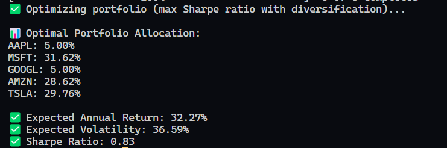
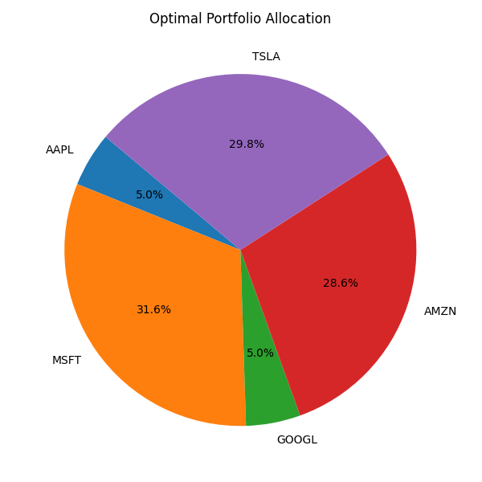

# **QuantInvest – AI-Powered Portfolio Optimizer & Stock Predictor**

### 🚀 *A Machine Learning + Finance project demonstrating applied quantitative research and portfolio optimization skills*  

   

---

## **📌 Overview**
**QuantInvest** combines **Machine Learning** and **Modern Portfolio Theory (MPT)** to:
1. **Predict stock returns** using a Random Forest Regressor trained on historical prices & technical indicators  
2. **Optimize portfolio allocations** to maximize **Sharpe Ratio** while controlling risk  
3. **Serve real-time predictions via a Flask REST API** (deployed on Render)  

This project demonstrates **practical quantitative research, financial modeling, and software engineering skills** relevant to investment banking, trading, and risk analytics.

---

## **🌐 Live Demo**
✅ **Base URL**: [https://quant-invest-awub.onrender.com](https://quant-invest-awub.onrender.com)  

## 🔥 Live Demo Screenshot


## 📊 Portfolio Allocation (Pie Chart)


### **1) Health Check**  
`GET /`  
```json
{ "message": "QuantInvest API is running 🚀" }
```
**2) Predict Stock Prices**
`POST /predict /` 
`request`
```json
{ "ticker": "AAPL"  }
```
`response`
```json
{
  "ticker": "AAPL",
  "predicted_price": 212.45,
  "model": "RandomForestRegressor"
}
```
**3) Optimise Portfolio**  
`GET/Optimise /` 
`request`
```json
{
  "Optimal Portfolio Allocation": {
    "AAPL": 15.4,
    "MSFT": 22.8,
    "GOOGL": 18.6,
    "AMZN": 21.3,
    "TSLA": 12.1,
    "NVDA": 9.8
  },
  "Expected Annual Return": "27.54%",
  "Annual Volatility": "19.23%",
  "Sharpe Ratio": 1.43
}

```
⚙️ Tech Stack
- Python (Pandas, NumPy, Scikit-learn, SciPy) – data analysis & machine learning
- Modern Portfolio Theory (MPT) – portfolio optimization
- Flask REST API – real-time prediction & optimization service
- Deployed on Render (Gunicorn + Flask)

📈 Skills Demonstrated
✅ Quantitative Finance – Applied MPT & risk-adjusted return optimization
✅ Machine Learning for Trading – Random Forest regression for stock prediction
✅ API Development – Flask REST API for scalable financial analytics
✅ Cloud Deployment – Render-hosted, production-ready service

▶ Quick Start (Local)
```json{
git clone https://github.com/yourusername/quantinvest.git
cd quantinvest
pip install -r requirements.txt
python app.py}
```

Then open:
http://127.0.0.1:5000


💡 Author
Reecha


